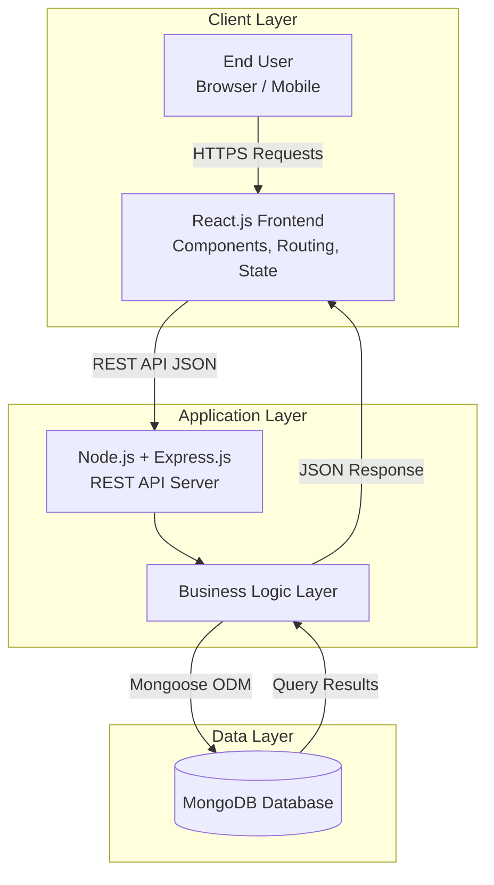

# OPSIE SOFTWARE SOLUTIONS INC.

Landing page for Opsie Software Solutions Inc., where ideas are turned into scalable and maintainable software systems.

## MERN Stack Technology
This project is built using the MERN stack, a popular full-stack JavaScript framework that enables seamless development of modern web applications.

| Layer          | Technology          |
|----------------|---------------------|
| Frontend       | ReactJS + Vite      |
| Backend        | NodeJS w/ ExpressJS |
| Database       | MongoDB / JSON      |
| Versioning     | Git + Github        |
| Dev Tools      | VS Code, Postman    |



## Features
* Landing Page
    * Modern and responsive user interface
    * Clear presentation of services being offered
    * Professional, clean, and unique design

* Inquiry Handling
    * Users can submit inquiries through a contact form
    * Inquiry data stored in the database

* Bug/issue reporting
    * Users can report bugs with detailed descriptions
    * Issue data stored in the database

* CRM (server-side)
    * Management of inquiries, issues, and content
    * Backend API built with Node.js & Express

## Repository Structure
root/
│
├── backend/                   # Node.js + Express backend
│   ├── controllers/         # Business logic for routes
│   ├── middleware/          # Authentication, error handling, etc.
│   ├── models/              # Mongoose models / database schemas
│   ├── routes/              # API route definitions
│   ├── utils/               # Common utility functions
│   ├── gitignore            # Files/folders to ignore in Git
│   ├── package.json         # Backend dependencies
│   └── server.js            # Main server entry point
|
├── frontend/                  # React frontend
│   ├── public/              # Static files
│   ├── src/                 # React source code
│   │   ├── assets/          # Asset files
│   │   ├── components/      # Reusable UI components
│   │   ├── hooks/           # Custom hooks
│   │   ├── pages/           # Page-level components
│   |   ├── utils/           # Helper functions and components
│   │   ├── App.css          # Main React component style
│   │   ├── App.jsx          # Main React component
│   │   ├── main.css         # React entry point style
│   │   └── main.jsx         # React entry point
|   ├── gitignore            # Files/folders to ignore in Git
│   ├── package.json         # ESLint configuration file
|   ├── index.html           # Main HTML template
│   ├── package.json         # Frontend dependencies
│   └── vite.config.js       # Vite configuration file
│
├── README.md                # Project documentation
└── package.json             # Root-level scripts and dependencies (optional)

## Installations
### 1. Clone the repository
```
git clone https://github.com/jbarbosagahr01/OpsieWebsite.git
```
### 2. Install Dependencies
```
cd backend && npm install
cd ../frontend && npm install
```
### 3. Development
```
# Run backend
cd backend && npm start

# Run frontend
cd frontend && npm run dev
```
Visit: http://localhost:5173

## Contribution Guidelines
Follow these steps to contribute effectively:
* Fork the Repository
    * Click the Fork button on GitHub to create your own copy of the project.
    
* Clone Your Fork
    * Run:
```
git clone https://github.com/jbarbosagahr01/OpsieWebsite.git
```

* Create a Develop or Feature Branch
    * Keep your changes organized:
```
git checkout -b your-name/dev
# Example: git checkout -b ansari/dev
```

* Set Up the Environment
    * Follow the setup instructions in the README to install dependencies.

* Use Clear Commit Messages
    * Indicate if you are adding a feature, fixing a bug, or restructuring a code.

* Submit a Pull Request (PR)
    * Push your branch and open a PR with a short, clear description of your changes.